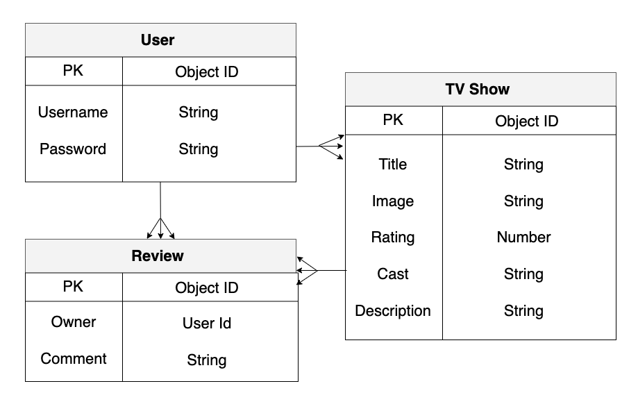
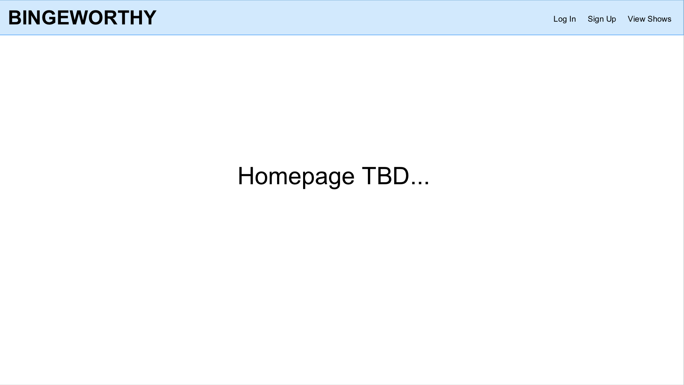
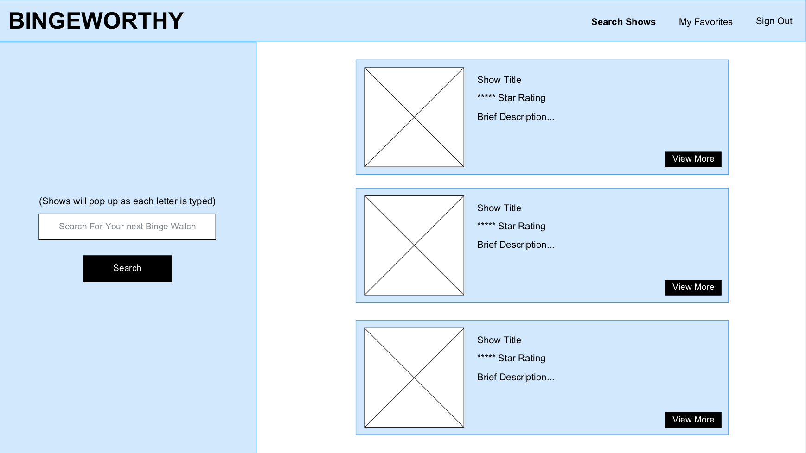
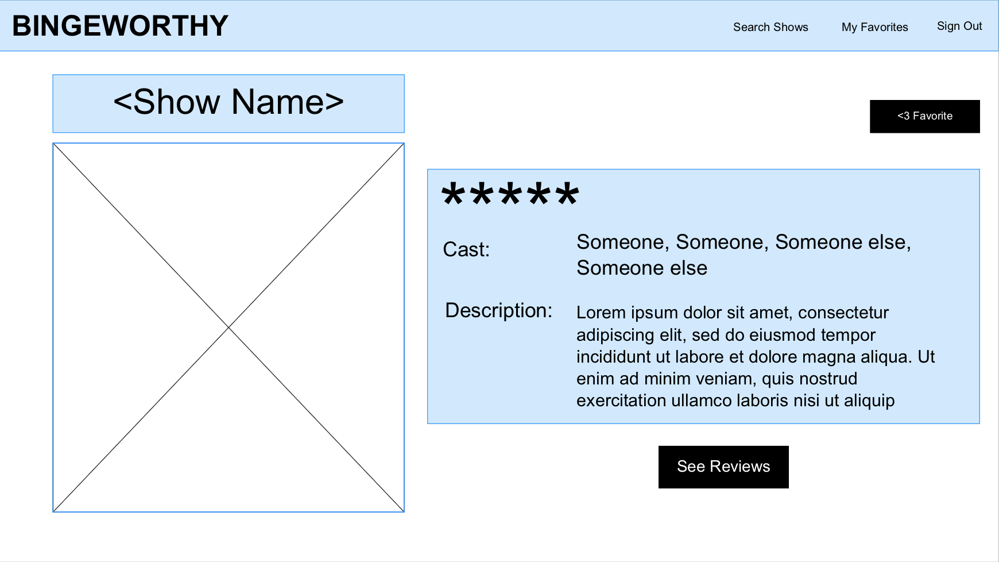
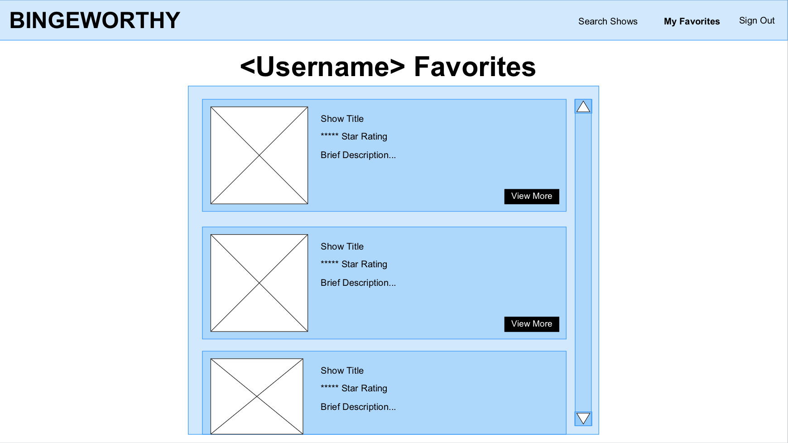
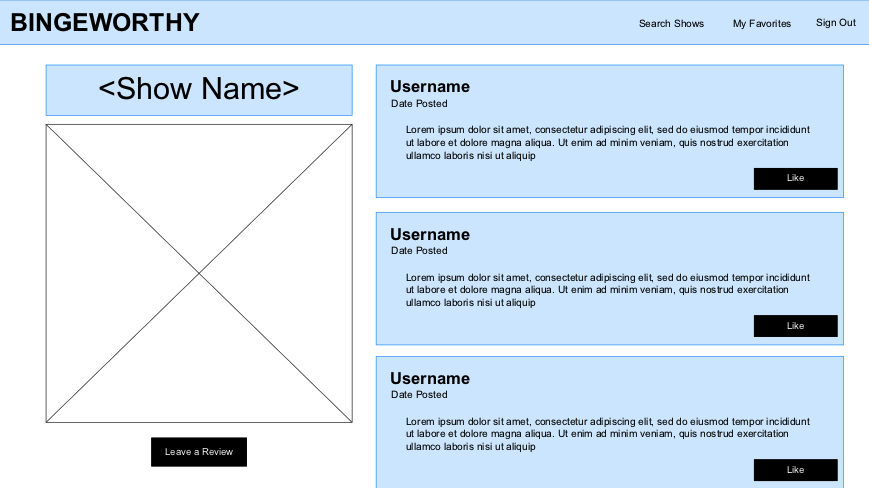
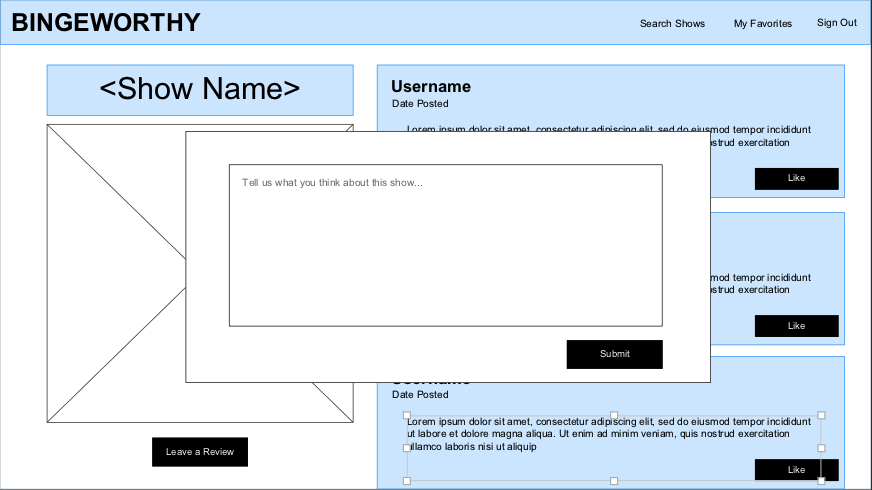

# Project-4
# Bingeworthy

## Overview:

Bingeworthy is a fullstack application that provides users with the ability to search tv shows, save their favorite tv shows, and leave reviews on tv shows. The user has the ability to make an account to keep track of all of their favorite shows.

## Technologies Used:

- HTML
- CSS
- Bootstrap
- Javascript
- Express 
- React
- NPM
- Node.js
- MongoDB 

## User Story:

As a user I want the ability to:
- sign up.
- sign in. 
- search a database of tv shows.
- "favorite" tv shows and save them in my account.
- view all of my favorited tv shows. 
- create reviews on tv shows. 
- edit my own reviews on tv shows. 
- delete my own reviews on tv shows. 
- like reviews made by other users.

## Entity Relationship Diagram:

## Wireframe:

## Plan for Completion:

- back-end initial set-up with API
- tv show search functionality set-up
- favoriting functionality
- review functionality
- styling

## Developer Journey:
There are many things that I have learned/gained more understanding of during this project inclduing:
- the life cycle of components
- promise chains
- implementing external APIs
- react component relationships (and the importance of diagrams)
- the concept of use effect and the importance of the dependency array

## Goals for the Future:
- change email to username and display in reviews posted
- allow users to like/dislike others reviews
- allow users to favorite/unfavorite tv shows
- delete a show from favorited list when unfavorited

## Bugs to Fix:
- reviews are not deleting properly